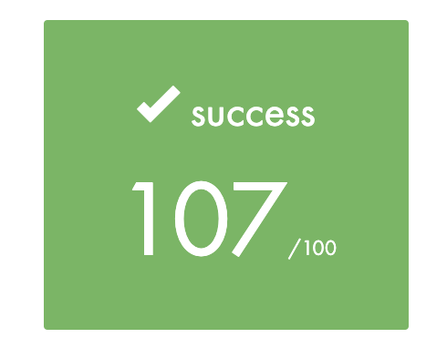

# Get Next Line 📝

The goal of this project is to write a function that reads a line ending with a newline character ('\n') from a file descriptor. The size of the line is unknown for the function. Get_next_line introduces to a highly interesting new concept in C programming: static variables and their proper and efficient usage.
</br></br>

### Installation:
```git clone https://github.com/psprawka/Get_next_line.git```

### Return value:
* return `1` when it read a line
* return `0` when it finished reading a file
* return `-1` when an error occurs
</br>

### My score for Get Next Line:
<p float="left">
  
</p>
